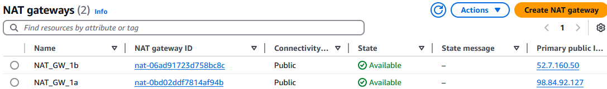
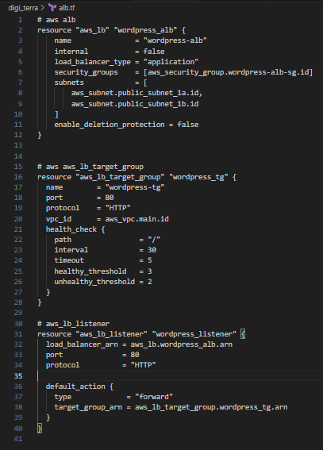

# Automated-Website-Deployment-on-AWS

## Project Task 
Digiboost, a digital marketing agency aims to elevate its online presence by launching a high-performance Wordpress website for their clients. As an AWS solutions architect, your task is to design and implement a scalable secure and cost-effective Wordpress solution using various AWS services. Automation through Terraform will be key to achieving a streamlined and reproducible deployment process.

## Project Overview


This design provides a strong foundation for a scalable, secure, and highly available WordPress environment on AWS. Here’s a quick breakdown of the key components and how they align with the goals for Digiboost’s WordPress deployment:

1. VPC with Public and Private Subnets:
    - The architecture isolates web servers and databases in private subnets, enhancing security by limiting direct internet exposure.

2. Internet Gateway and NAT Gateway:
    - The Internet Gateway allows resources in public subnets to connect to the internet (e.g., ALB).
    - NAT Gateways in each AZ allow private subnet resources to access the internet without exposing them directly.

3. High Availability and Fault Tolerance:
    - Two Availability Zones (AZs) are used for redundancy, with resources like web servers and RDS instances distributed across AZs.

4. MySQL RDS and EFS:
    - RDS is configured for high availability with a standby DB instance in a secondary AZ, ensuring failover in case of an outage.
    - EFS provides shared storage accessible by all web server instances, useful for shared WordPress files such as media uploads.

5. Load Balancer and Auto Scaling Group (ASG):
    - The Application Load Balancer (ALB) distributes incoming traffic across multiple instances in the ASG, providing load balancing across AZs.
    - ASG enables automatic scaling based on traffic demand, ensuring performance and cost efficiency.

6. Route 53 for DNS Management:
    - Route 53 manages domain registration and traffic routing to the ALB, making the solution globally accessible and resilient.

This setup achieves a balance of security, scalability, and cost-effectiveness. 

Additionally, Terraform can automate the provisioning and management of these resources, allowing for consistency and easier maintenance.

## Project Components

Before we setup the project, let's setup terraform on our ubuntu server.

- Install Terraform on the server and then confirm installation using the command `terraform -v`


- Next, create a project directory and cd into the directory.


- Install and configure AWS CLI on the server


- create Terraform main configuration file


### 1. VPC Setup

### VPC Architecture


**Objective:** Create a virtual private cloud to isolate and secure the wordpress infrastructure.

**Steps:** 
- Define IP address range for the VPC.
- Create VPC with public and private subnets.

**Instructions for Terraform:** 
- Use Terraform to define VPC and subnets .
- Leverage variables for customization.
- Document Terraform commands for execution.

1. *Use the provider module to allow terraform to interact with AWS*

```
terraform {
  required_providers {
    aws = {
      source = "hashicorp/aws"
      version = "5.78.0"
    }
  }
}

provider "aws" {
  # Configuration options
}
```


2. *Create VPC with public and private subnets*

```
# create VPC 
resource "aws_vpc" "main" {
  cidr_block = "10.0.0.0/16"
  enable_dns_support = true
  enable_dns_hostnames = true
  tags = {
    Name = "Digiboost_WordPressVPC"
  }
}

# create public subnets
resource "aws_subnet" "public_subnet_1a" {
  vpc_id                  = aws_vpc.main.id
  cidr_block              = "10.0.1.0/24"
  availability_zone       = "us-east-1a"
  map_public_ip_on_launch = true

  tags = {
    Name = "Digiboost_public_subnet_1a"
  }
}

resource "aws_subnet" "public_subnet_1b" {
  vpc_id                  = aws_vpc.main.id
  cidr_block              = "10.0.2.0/24"
  availability_zone       = "us-east-1b"
  map_public_ip_on_launch = true

  tags = {
    Name = "Digiboost_public_subnet_1b"
  }
}

# create private subnets
resource "aws_subnet" "private_subnet_1a" {
  vpc_id                  = aws_vpc.main.id
  cidr_block              = "10.0.3.0/24"
  availability_zone       = "us-east-1a"
  map_public_ip_on_launch = false

  tags = {
    Name = "Digiboost_private_subnet_1a"
  }
}

resource "aws_subnet" "private_subnet_1b" {
  vpc_id                  = aws_vpc.main.id
  cidr_block              = "10.0.4.0/24"
  availability_zone       = "us-east-1b"
  map_public_ip_on_launch = false

  tags = {
    Name = "Digiboost_private_subnet_1b"
  }
}
```


#### VPC 


#### Subnets


### 2. Internet gateway, NAT gateway and Elastic IP.

### NAT Gateway Architecture


**Objective:** Implement a secure network architecture with public and private subnets. Use an internet gateway fpr public subnet internet access and a NAT gateway for private subnet internet access.

**Steps:** 
- Setup internet gateway for public subnet internet access.
- Configure a NAT gateway for private subnet internet access.

**Instructions for Terraform:** 
- Use Terraform to define internet gateway and NAT gateway.
- Document Terraform commands for execution.

```
# create internet gateway
resource "aws_internet_gateway" "gw" {
  vpc_id = aws_vpc.main.id

  tags = {
    Name = "IGW"
  }
}

# NAT Gateway in AZ 1a
resource "aws_nat_gateway" "nat_1a" {
  allocation_id = aws_eip.nat_1a.id
  subnet_id     = aws_subnet.public_subnet_1a.id

  tags = {
    Name = "NAT_GW_1a"
  }
}

# NAT Gateway in AZ 1b
resource "aws_nat_gateway" "nat_1b" {
  allocation_id = aws_eip.nat_1b.id
  subnet_id     = aws_subnet.public_subnet_1b.id

  tags = {
    Name = "NAT_GW_1b"
  }
}

# Elastic IP for NAT Gateway in AZ 1a
resource "aws_eip" "nat_1a" {
  domain = "vpc"

  tags = {
    Name = "NAT_EIP_1a"
  }
}

# Elastic IP for NAT Gateway in AZ 1b
resource "aws_eip" "nat_1b" {
  domain = "vpc"

  tags = {
    Name = "NAT_EIP_1b"
  }
}
```


#### Internet Gateway


#### NAT Gateway


### 3. Route Tables

**Steps:** 
- Create a `Route Table` for each `Subnet`.
- Ensure proper association of resources with corresponding subnets.

**Instructions for Terraform:** 
- Use Terraform to define public and private route tables.
- Define Terraform scripts to associate resources with subnets.
- Document Terraform commands for execution.

```
# create public route table
resource "aws_route_table" "public" {
  vpc_id = aws_vpc.main.id

  route {
    cidr_block = "0.0.0.0/0"
    gateway_id = aws_internet_gateway.gw.id
  }

  tags = {
    Name = "Public_Route_Table"
  }
}

# public route table association for subnet 1a
resource "aws_route_table_association" "public_rt_association_1a" {
  subnet_id      = aws_subnet.public_subnet_1a.id
  route_table_id = aws_route_table.public.id
}

# public route table association for subnet 1b
resource "aws_route_table_association" "public_rt_association_1b" {
  subnet_id      = aws_subnet.public_subnet_1b.id
  route_table_id = aws_route_table.public.id
}


# create private route table for Subnet 1a
resource "aws_route_table" "private_1a" {
  vpc_id = aws_vpc.main.id

  route {
    cidr_block = "0.0.0.0/0"
    gateway_id = aws_nat_gateway.nat_1a.id
  }

  tags = {
    Name = "Private_Route_Table_1a"
  }
}

# create private route table for Subnet 1b
resource "aws_route_table" "private_1b" {
  vpc_id = aws_vpc.main.id

  route {
    cidr_block = "0.0.0.0/0"
    gateway_id = aws_nat_gateway.nat_1b.id
  }

  tags = {
    Name = "Private_Route_Table_1b"
  }
}

# Private route table association for subnet 1a
resource "aws_route_table_association" "private_rt_association_1a" {
  subnet_id      = aws_subnet.private_subnet_1a.id
  route_table_id = aws_route_table.private_1a.id
}

# Private route table association for subnet 1b
resource "aws_route_table_association" "private_rt_association_1b" {
  subnet_id      = aws_subnet.private_subnet_1b.id
  route_table_id = aws_route_table.private_1b.id
}
```


#### route Table


### 4. AWS MYSQL RDS setup


**Objective:** Deploy a managed SQL database using Amazon RDS for wordpress data storage.

**Steps:** 
- Create an Amazon RDS instance with MYSQL engine. 
- Configure security groups for the RDS instance.
- Connect wordpress to the RDS database.

**Instructions for Terraform:** 
- Define Terraform scripts for RDS instance creation.
- Configure security groups and define neccessary parameters.
- Document Terraform conmmands for execution.

```
# rds db
variable "db_username" {
  type = string
}

variable "db_password" {
  type = string
}

resource "aws_db_instance" "wordpress_db" {
  allocated_storage      = 10
  engine                 = "mysql"
  engine_version         = "8.0"
  instance_class         = "db.t3.micro"
  username               = var.db_username
  password               = var.db_password
  parameter_group_name   = "default.mysql8.0"
  multi_az               = false
  publicly_accessible    = false
  skip_final_snapshot    = true

  tags = {
    Name        = "WordPress_DB"
 }
 
}
```


### Relational Database Service (RDS)


### 5. EFS setup for wordpress files

**Objective:** Utilize Amazon Elastic Files System (EFS) to store WordPress files for scalable and shared access.

**Steps:** 
- Create an EFS file System. 
- Mount the EFS file system on WordPress instances.
- Configure WordPress to use the shared file system. 

**Instructions for Terraform:** 
- Develop Terraform scripts to create EFS file System.
- Define configurations for mounting EFS on WordPress instances. 
- Document Terraform commands for execution.

```
# Elastic File System
resource "aws_efs_file_system" "wordpress" {
  creation_token = "efs-for-wordpress"
  tags = {
    Name = "WordPressEFS"
  }
}

# EFS mount
resource "aws_efs_mount_target" "wordpress_mount_1a" {
  file_system_id = aws_efs_file_system.wordpress.id
  subnet_id      = aws_subnet.private_subnet_1a.id
  security_groups = [aws_security_group.efs_sg.id]
}

resource "aws_efs_mount_target" "wordpress_mount_1b" {
  file_system_id = aws_efs_file_system.wordpress.id
  subnet_id      = aws_subnet.private_subnet_1b.id
  security_groups = [aws_security_group.efs_sg.id]
}
```


### Elastic File System (EFS)


### 5. Application Load Balancer

**Objective:** Set up an Application Load Balancer to distribute incoming traffic among multiple instances, ensuring high availabilty and fault tolerance.

c an Application Load Balancer (ALB).
- Configure listener rules for routing traffic to instances.
- Integrate Load Balancer with Auto Scaling Group.

**Instructions for Terraform:** 
- Use Terraform to define Application Load Balancer configurations.
- Integrate Load Balancer with Auto Scaling Group.
- Document Terraform commands for execution.

```
# aws alb
resource "aws_lb" "wordpress_alb" {
    name               = "wordpress-alb"
    internal           = false
    load_balancer_type = "application"
    security_groups    = [aws_security_group.wordpress-alb-sg.id]
    subnets            = [
        aws_subnet.public_subnet_1a.id,
        aws_subnet.public_subnet_1b.id
    ]
    enable_deletion_protection = false
}


# aws aws_lb_target_group
resource "aws_lb_target_group" "wordpress_tg" {
  name        = "wordpress-tg"
  port        = 80
  protocol    = "HTTP"
  vpc_id      = aws_vpc.main.id
  health_check {
    path                = "/"
    interval            = 30
    timeout             = 5
    healthy_threshold   = 3
    unhealthy_threshold = 2
  }
}

# aws_lb_listener
resource "aws_lb_listener" "wordpress_listener" {
  load_balancer_arn = aws_lb.wordpress_alb.arn
  port              = 80
  protocol          = "HTTP"

  default_action {
    type             = "forward"
    target_group_arn = aws_lb_target_group.wordpress_tg.arn
  }
}
```



### Application Load Balancer (ALB)


### 6. Auto Scaling Group

**Objective:** Implement Auto Scaling to automatically adjust the number of instances based on traffic load.

**Steps:** 
- Create an Auto Scaling Group.
- Define Scaling Policies based on metrics like CPU utilization.
- Configure launch configurations for instances. 

**Instructions for Terraform:** 
- Develop Terraform scripts for Auto Scaling Group creation. 
- Define scaling policies and launce configurations.
- Document Terraform commands for execution.

```
# EC2 aws_launch_template
resource "aws_launch_template" "wordpress_lt" {
  name_prefix   = "wordpress-lt"
  image_id      = "ami-009e15d90a54ab8ff" # Replace with your WordPress AMI ID
  instance_type = "t2.micro"
  key_name      = "wordpress-key"

  network_interfaces {
    associate_public_ip_address = false
    subnet_id                   = aws_subnet.private_subnet_1a.id
    security_groups             = [aws_security_group.ec2_sg.id]
  }

  user_data = base64encode(<<-EOF
  #!/bin/bash
  sudo yum update -y
  sudo yum install -y httpd
  sudo service httpd start
  EOF
  )
}

# aws_autoscaling_group
resource "aws_autoscaling_group" "wordpress_asg" {
  launch_template {
    id      = aws_launch_template.wordpress_lt.id
    version = "$Latest"
  }

  vpc_zone_identifier = [
    aws_subnet.private_subnet_1a.id,
    aws_subnet.private_subnet_1b.id
  ]

  target_group_arns = [aws_lb_target_group.wordpress_tg.arn]

  min_size                  = 1
  max_size                  = 3
  desired_capacity          = 2
  health_check_type         = "ELB"
  health_check_grace_period = 300

  tag {
    key                 = "Name"
    value               = "WordPress-ASG"
    propagate_at_launch = true
  }

}
```


### Auto Scling Group (ASG)


7. ### Security Group Architecture

```
# SG for ALB
resource "aws_security_group" "wordpress-alb-sg" {
  name        = "wordpress-alb-sg"
  description = "Security group for WordPress ALB"
  vpc_id      = aws_vpc.main.id

  
  # Allow HTTP and HTTPS traffic from the internet
  ingress {
    from_port   = 80
    to_port     = 80
    protocol    = "tcp"
    cidr_blocks = ["0.0.0.0/0"]
  }

  ingress {
    from_port   = 443
    to_port     = 443
    protocol    = "tcp"
    cidr_blocks = ["0.0.0.0/0"]
  }

  # Allow all outbound traffic
  egress {
    from_port   = 0
    to_port     = 0
    protocol    = "-1"
    cidr_blocks = ["0.0.0.0/0"]
  }

  tags = {
    Name = "wordpress-alb-sg"
  }
}

# EFS security group
resource "aws_security_group" "efs_sg" {
  name        = "efs-sg"
  description = "Allow NFS traffic for EFS"
  vpc_id      = aws_vpc.main.id

  ingress {
    from_port   = 2049
    to_port     = 2049
    protocol    = "tcp"
    cidr_blocks = ["10.0.0.0/16"] # Adjust to your VPC CIDR
  }

  egress {
    from_port   = 0
    to_port     = 0
    protocol    = "-1"
    cidr_blocks = ["0.0.0.0/0"]
  }

  tags = {
    Name = "EFS_Security_Group"
  }
}

# EC2 security group
resource "aws_security_group" "ec2_sg" {
  name        = "EC2-SG"
  description = "Security group for EC2 instances"
  vpc_id      = aws_vpc.main.id

  ingress {
    from_port   = 80
    to_port     = 80
    protocol    = "tcp"
    security_groups = [aws_security_group.wordpress-alb-sg.id]
  }

  egress {
    from_port   = 0
    to_port     = 0
    protocol    = "-1"
    cidr_blocks = ["0.0.0.0/0"]
  }

  tags = {
    Name = "EC2_Security_Group"
  }
}
```


#### Security Groups (SG)


#### Wordpress SG


#### EC2 SG


## Terraform variables and values
### Terraform.tfvars
A Terraform.tfvars file is a file that defines variables and values for Terraform configurations.

Often you need to configure your infrastructure using sensitive or secret information such as usernames, passwords, API tokens, or Personally Identifiable Information (PII). 
When you do so, you need to ensure that you do not accidentally expose this data in CLI output, log output, or source control. There are several features to help avoid accidentally exposing sensitive data.
One of such is replace the database's hard-coded credentials with variables configured with the sensitive flag. Terraform will then redact these values in the output of Terraform commands or log messages. 
Next, you will set values for these variables using environment variables and with a .tfvars file.


Organizing Terraform configurations into separate modules for semi-complex to complex projects offers several benefits:

    1. Improved Organization: Each module encapsulates a specific piece of functionality (e.g., VPC, EC2, RDS, etc.), making the configuration easier to read and maintain.

    2. Reusability: Modules can be reused across different environments or projects, saving time and ensuring consistency.

    3. Simplified Troubleshooting: By isolating resources into modules, identifying and resolving issues becomes more straightforward since you only need to debug a specific module.

    4. Collaboration: When modules are well-defined, different team members can work on separate parts of the infrastructure simultaneously, reducing conflicts and improving productivity.

    5. Version Control: Modules can be versioned independently, enabling teams to manage updates and changes without affecting the entire infrastructure.

    6. Scalability: As the project grows, adding new features or services becomes more manageable when using modules. 

### Example Structure for Terraform Modules
```
terraform-project/
├── main.tf                   # Entry point for the Terraform configuration
├── variables.tf              # Global variables shared across modules
├── outputs.tf                # Global outputs shared across modules
├── modules/
│   ├── vpc/
│   │   ├── main.tf           # Configuration for VPC resources
│   │   ├── variables.tf      # Variables specific to VPC
│   │   └── outputs.tf        # Outputs specific to VPC
│   ├── ec2/
│   │   ├── main.tf           # Configuration for EC2 instances
│   │   ├── variables.tf      # Variables specific to EC2
│   │   └── outputs.tf        # Outputs specific to EC2
│   ├── rds/
│   │   ├── main.tf           # Configuration for RDS resources
│   │   ├── variables.tf      # Variables specific to RDS
│   │   └── outputs.tf        # Outputs specific to RDS
│   └── other-service/        # Additional modules as needed
└── environments/
    ├── dev/
    │   ├── main.tf           # Dev environment-specific configurations
    │   ├── variables.tf
    │   └── backend.tf        # Backend configuration for state storage
    ├── staging/
    │   ├── main.tf           # Staging environment-specific configurations
    │   ├── variables.tf
    │   └── backend.tf
    └── prod/
        ├── main.tf           # Production environment-specific configurations
        ├── variables.tf
        └── backend.tf
```


After all the modules have been set up, implement your Terraform configurations in the following sequence as below: 

## Terraform validate

`terraform validate`

This ensures that the configuration is syntactically correct and ready to use.


## Terraform plan

`terraform plan` 

This shows the execution plan, allowing you to review the resources that will be created, modified, or destroyed.

Alternatively, use

`terraform plan -out=tfplan` 

The -out=tfplan option in the terraform plan command saves the execution plan to a file, ensuring that the same plan is applied, reducing the chances of unintended changes.


## Terraform apply

`terraform apply`

This executes the changes as per the plan.

or alternatively use 

`terraform apply tfplan` (if previously ran `terraform plan -out=tfplan`)


After applying your Terraform configuration, you’ll need to test the setup to ensure the infrastructure is working correctly. 


### Test the ALB DNS Name

Access in Browser: Open the ALB DNS name in your browser:

`http://<ALB_DNS_NAME>`


**Note:** If you followed the project and ran all the above steps for a test environment and not for the production environment, do not forget to tear down all the resources created in AWS using terraform destroy to avoid incurring unnecessary costs from AWS or any other cloud service provider used.


